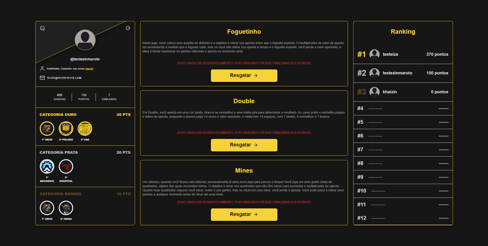
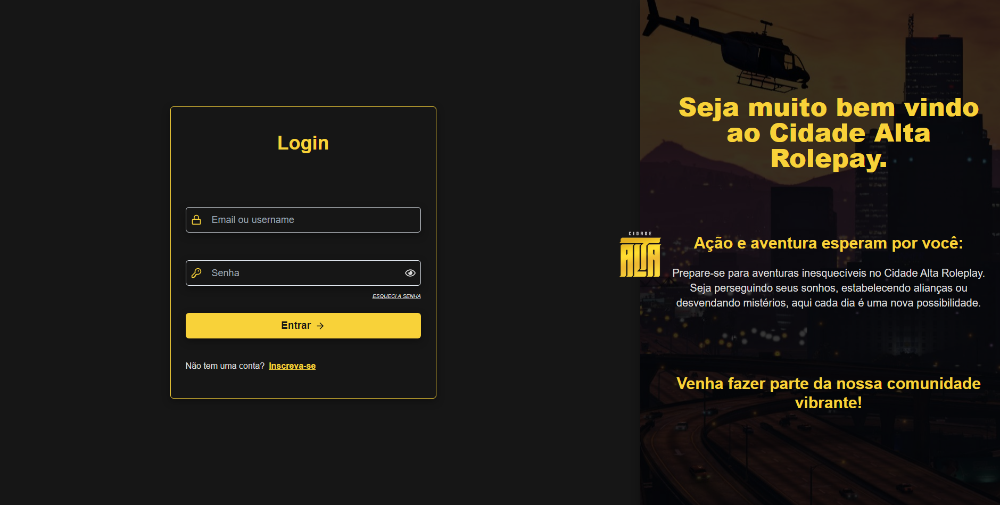

# Desafio para Vaga de Desenvolvedor FullStack na Empresa Cidade Alta

---

---

## Sobre o Projeto

Este projeto é um desafio para a vaga de Desenvolvedor FullStack na empresa Cidade Alta. A aplicação consiste em um sistema de login com credenciais tradicionais, onde os dados dos usuários são protegidos utilizando cookies com a flag `httpOnly`. O dashboard apresenta informações do usuário logado, permitindo editar dados como email com confirmação de alteração. Além disso, há um ranking global e a funcionalidade de resgatar emblemas aleatórios.

## Funcionalidades Implementadas

- **Login**: Autenticação utilizando OAuth e/ou credenciais tradicionais.
- **Logout**: Permite que o usuário inicie uma sessão, limpando os cookies no servidor.
- **Proteção de Dados**: Utilização de cookies com a flag `httpOnly` para proteger os dados dos usuários.
- **Dashboard**: Exibe informações do usuário logado.
- **Edição de Usuário**: Permite editar o perfil do usuário, com confirmação de alteração no email.
- **Ranking Global**: Mostra a posição do usuário em um ranking global.
- **Resgate de Emblemas**: Funcionalidade para resgatar emblemas aleatórios.

## Instalação

Para executar este projeto, siga as instruções nos respectivos READMEs do frontend e do backend:

- [README do Frontend](./frontend/README.md)
- [README do Backend](./backend/README.md)

Lembre-se de configurar os arquivos `.env` de acordo com o `.env.example` fornecido para fins de teste. Lembrando que nos .env.example são todos os dados para fins de teste dos recrutadores, por conta de não existir o app em produção.
